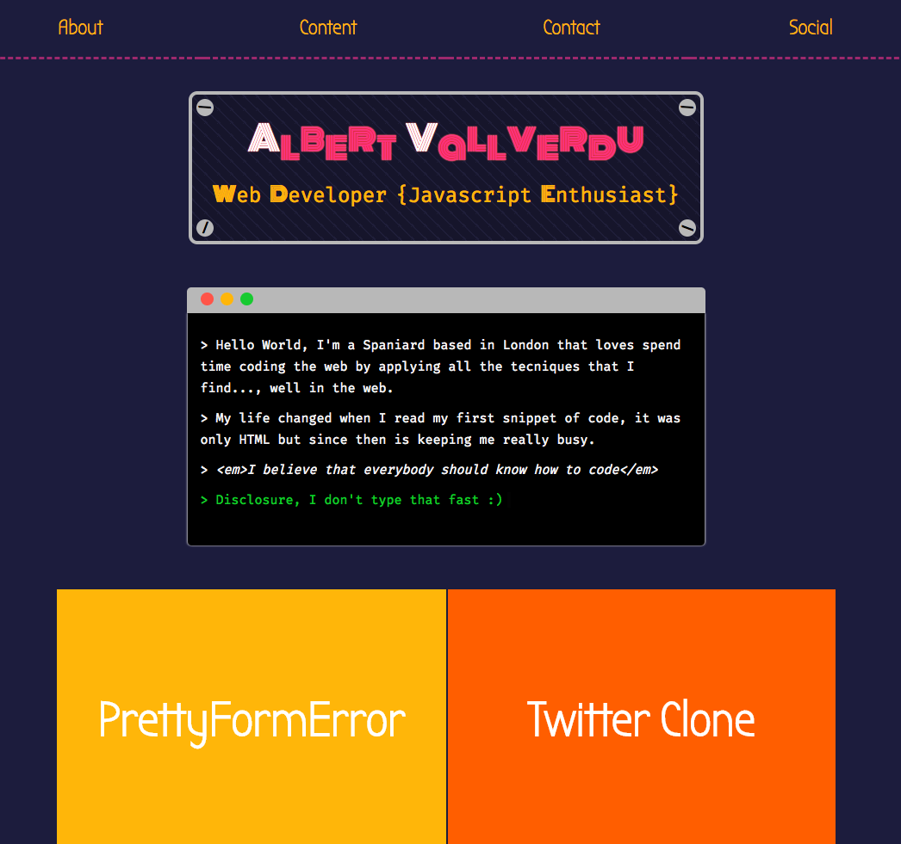

[](https://travis-ci.org/byverdu/portfolio)

# Byverdu Portfolio

New flavour for my portfolio, this time usin react.

This repo is build using `create-react-app`.


##### How to use

```bash
> git clone https://github.com/byverdu/portfolio.git
> cd portfolio
> npm install
#  run the app with files bundled
> npm start
# development
> cd app
> npm install
# run tests
> npm run test
# view app @ http://localhost:3000
> npm start 
# bundle app
> npm run build
```

